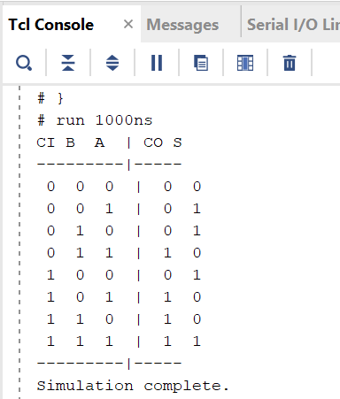
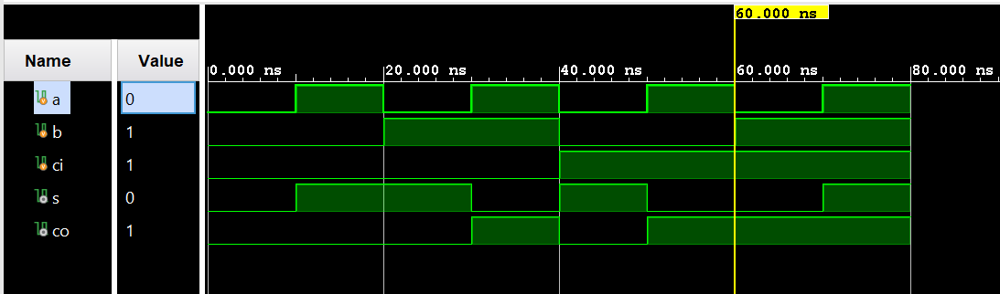
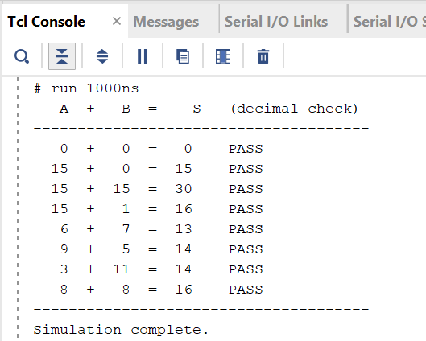
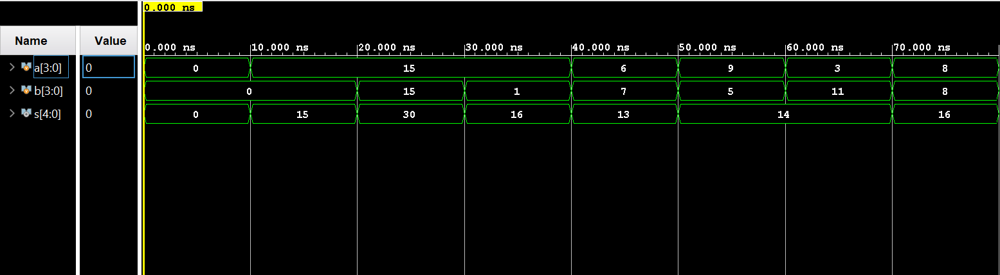

# Lab 2 — Mapping Your Circuit to FPGA
### DDCA MIPS Processor Project

---

## Overview

Designed and implemented a 4-bit ripple carry adder in Verilog using structural modeling — instantiating gate primitives explicitly rather than writing behavioral expressions. Verified the design through simulation and deployed it to a Basys 3 FPGA board, where physical switches serve as inputs and LEDs display the sum.

---

## Demo — Running on Basys 3 FPGA

<!-- 
  INSTRUCTIONS: 
  1. Record a short video (15-30 sec) of yourself flipping switches and observing LEDs
  2. Convert to GIF using https://ezgif.com (File → GIF, keep under 5MB)
  3. Save as `img/fpga_demo.gif` inside the lab2/ folder
  4. The line below will then render it automatically on GitHub
-->


*Two 4-bit numbers entered via switches (SW7–SW0), 5-bit sum displayed on LEDs (LD4–LD0).*

---

## Objectives

- [x] Derive full adder Boolean equations from a truth table
- [x] Implement a 1-bit full adder in Verilog using structural (gate-level) modeling
- [x] Instantiate four full adders to build a 4-bit ripple carry adder
- [x] Write testbenches and verify both modules through simulation
- [x] Create an XDC constraints file to map ports to physical FPGA pins
- [x] Program the Basys 3 FPGA and verify correct operation on hardware

---

## Background & Concepts

### Binary Addition and the Full Adder

Adding two binary numbers works exactly like decimal addition — digit by digit from right to left, with a carry propagating leftward whenever a column sum exceeds the maximum representable value. For binary, that threshold is 2 (since digits can only be 0 or 1).

A **full adder** handles one bit position in this process. It takes three 1-bit inputs — A, B, and a carry-in (CI) from the previous stage — and produces two 1-bit outputs: the sum (S) and a carry-out (CO) for the next stage.

### Structural vs. Behavioral Modeling

Verilog supports multiple levels of abstraction. **Behavioral modeling** lets you write the logic directly as a Boolean expression (`assign s = a ^ b ^ ci`). **Structural modeling** requires you to instantiate actual gate primitives (`xor`, `and`, `or`) and wire them together explicitly.

Structural modeling is more verbose but forces you to think at the gate level — which is exactly what matters when reasoning about hardware timing, area, and physical implementation.

---

## Part 1 — Full Adder Truth Table

| CI | B | A | CO | S |
|----|---|---|----|---|
| 0  | 0 | 0 | 0  | 0 |
| 0  | 0 | 1 | 0  | 1 |
| 0  | 1 | 0 | 0  | 1 |
| 0  | 1 | 1 | 1  | 0 |
| 1  | 0 | 0 | 0  | 1 |
| 1  | 0 | 1 | 1  | 0 |
| 1  | 1 | 0 | 1  | 0 |
| 1  | 1 | 1 | 1  | 1 |

### Derived Boolean Equations

**Sum:**
```
S = A XOR B XOR CI
```

**Carry-out (K-Map minimized):**
```
CO = (A AND B) OR (CI AND A) OR (CI AND B)
```

**Carry-out (algebraically simplified):**
```
CO = (A AND B) OR (CI AND (A XOR B))
```

Both CO expressions are logically equivalent. The simplified form is used in implementation because it reuses the intermediate `A XOR B` wire already computed for S — fewer gates, cleaner netlist.

---

## Implementation

### Module: `FullAdder.v`

**What it does:** Adds three 1-bit inputs and produces a 1-bit sum and carry-out using gate-level primitives.

**Interface:**

| Port | Direction | Width | Description |
|------|-----------|-------|-------------|
| `a`  | Input | 1 | First operand |
| `b`  | Input | 1 | Second operand |
| `ci` | Input | 1 | Carry-in from previous stage |
| `s`  | Output | 1 | Sum bit |
| `co` | Output | 1 | Carry-out to next stage |

**Design decisions:**
- Implemented using structural modeling only — `xor`, `and`, `or` gate primitives
- Intermediate wire `axb` (A XOR B) is shared between the S and CO computations, avoiding redundant gate instantiation
- Named port connections used throughout for clarity and safety

---

### Module: `FourBitAdder.v`

**What it does:** Chains four full adder instances to add two 4-bit numbers, producing a 5-bit result.

**Interface:**

| Port | Direction | Width | Description |
|------|-----------|-------|-------------|
| `a`  | Input | 4 | First 4-bit operand |
| `b`  | Input | 4 | Second 4-bit operand |
| `s`  | Output | 5 | 5-bit sum (4 sum bits + final carry-out) |

**Design decisions:**
- Carry-in of the LSB stage (`fa0`) is tied to `1'b0` — no carry entering from the right
- Internal carry wires `c1`, `c2`, `c3` connect stages in ripple fashion
- The final carry-out feeds directly into `s[4]`, the MSB of the output
- This is a **ripple carry adder** — carries propagate sequentially through each stage, which is simple but introduces carry propagation delay that grows with bit width

---

### Constraints File: `adder.xdc`

Maps Verilog port names to physical Basys 3 pins:

| Signal | Board Component | Physical Pin |
|--------|----------------|--------------|
| `a[0]`–`a[3]` | SW0–SW3 | V17, V16, W16, W17 |
| `b[0]`–`b[3]` | SW4–SW7 | W15, V15, W14, W13 |
| `s[0]`–`s[4]` | LD0–LD4 | U16, E19, U19, V19, W18 |

I/O standard set to LVCMOS33 for all ports (3.3V logic level, standard for Basys 3).

---

## Simulation & Testing

### Testbench: `tb_FullAdder.v` — Console Output



*Exhaustive test of all 8 input combinations — console output matches derived truth table.*

---

### Testbench: `tb_FullAdder.v` — Waveform



*Waveform showing input transitions and corresponding output responses across all 8 test cases.*

---

### Testbench: `tb_FourBitAdder.v` — Console Output



*8 test cases including corner cases (0+0, 15+15, overflow) — all PASS.*

---

### Testbench: `tb_FourBitAdder.v` — Waveform




*Waveform confirming correct sum output across all test cases, including carry propagation into s[4].*

---

## FPGA Verification

Hardware behavior matched simulation results exactly across all tested input combinations:

| A  | B  | Expected S | LD4-LD0 |
|----|----|------------|---------|
| 0  | 0  | 00000      | All off |
| 15 | 1  | 10000      | LD4 only |
| 15 | 15 | 11110      | LD4, LD3, LD2, LD1 |
| 6  | 7  | 01101      | LD3, LD2, LD0 |

See GIF demo at the top of this document.

---

## Key Takeaways

1. **Structural modeling forces gate-level thinking.** Writing `xor(axb, a, b)` instead of `assign axb = a ^ b` makes you explicitly account for every wire and gate — which is how hardware actually works.

2. **Wire reuse matters.** Sharing the `axb` intermediate signal between S and CO isn't just cleaner code — it reflects a real hardware optimization. In larger designs, redundant logic adds area and power consumption.

3. **Simulation before hardware.** Running the testbench first meant that when the FPGA lit up correctly, it wasn't a surprise — it was a confirmation. This is the right order of operations for any digital design.

---

## References

- Lab 2 Manual — ETH Zürich DDCA (Spring 2018)
- Lab 2 Manual — ETH Zürich DDCA (Spring 2025)
- Lab 2 Supplement Slides — ETH Zürich DDCA (Spring 2025)
- Harris & Harris — *Digital Design and Computer Architecture*, Chapter 1

---

*Completed: May 2026*
