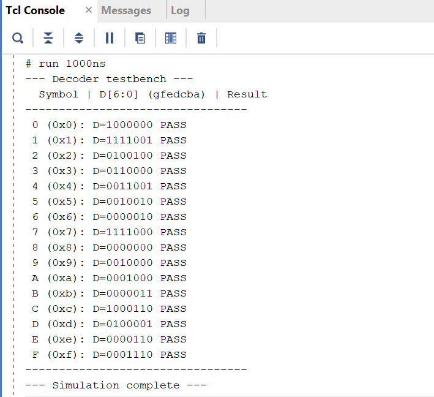
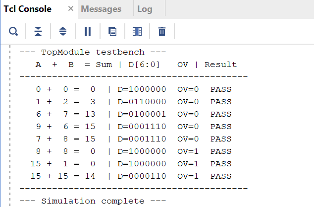

# Lab 3 — Verilog for Combinational Circuits
### DDCA MIPS Processor Project

---

## Overview

Designed and implemented a 7-segment display decoder in Verilog using behavioral modeling, then integrated it with the 4-bit adder from Lab 2 into a three-level module hierarchy. The result is a system that takes two 4-bit switch inputs, computes their sum, and displays the lower 4 bits as a hexadecimal character on the Basys 3's 7-segment display — with an overflow LED for sums exceeding 15.

---

## Demo — Running on Basys 3 FPGA

<!-- 
  INSTRUCTIONS:
  1. Save your GIF as img/fpga_demo.gif inside the lab3/ folder
-->


*Two 4-bit inputs entered via switches (SW7–SW0). Sum displayed as hex on the rightmost 7-segment display. Overflow LED lights when sum exceeds 15.*

---

## Objectives

- [x] Derive the 7-segment truth table for all 16 hexadecimal characters
- [x] Implement a behavioral Verilog decoder using `always @(*)` and `case`
- [x] Integrate the decoder with the Lab 2 adder via a top-level module
- [x] Route the overflow bit to a separate LED
- [x] Activate only the rightmost 7-segment display using anode control
- [x] Write self-checking testbenches for both the Decoder and TopModule
- [x] Verify on Basys 3 FPGA hardware

---

## Background & Concepts

### The 7-Segment Display

A 7-segment display is a package of seven individual LEDs labeled a through g, arranged to form digit-like shapes. By selectively turning segments on and off, any hexadecimal character (0–F) can be represented. On the Basys 3 board, the segments are **active-low** — a segment glows when driven with logic-0, not logic-1. This inverts the intuition from the LED work in Lab 2 and is the most common source of bugs in this lab.

The board has four 7-segment displays sharing the same segment inputs. Which display responds is controlled by four **anode** pins (also active-low). Driving `AN = 4'b1110` activates only the rightmost display.

### Behavioral vs. Structural Modeling

Lab 2 used structural modeling — explicit gate instantiations wired together. This lab switches to **behavioral modeling**, where you describe *what* the circuit does rather than *how* it's built. A `case` statement inside an `always @(*)` block encodes the full truth table directly, and the synthesizer figures out the optimal gate-level implementation automatically. The result is the same hardware, written in a fraction of the code.

### Module Hierarchy

This lab introduces a three-level design hierarchy for the first time:

```
TopModule
├── FourBitAdder  (reused from Lab 2)
│   ├── FullAdder fa0
│   ├── FullAdder fa1
│   ├── FullAdder fa2
│   └── FullAdder fa3
└── Decoder       (new)
```

TopModule is purely structural — it instantiates submodules and wires them together. No logic lives at the top level. This separation of concerns is a core principle of scalable RTL design.

---

## Part 1 — 7-Segment Truth Table

Segments are active-low: **0 = glows, 1 = off**. Bit ordering: `D[0]=a, D[1]=b, D[2]=c, D[3]=d, D[4]=e, D[5]=f, D[6]=g`.

| Display | S3 | S2 | S1 | S0 | a | b | c | d | e | f | g | D[6:0] (gfedcba) |
|---------|----|----|----|----|---|---|---|---|---|---|---|------------------|
| 0 | 0 | 0 | 0 | 0 | 0 | 0 | 0 | 0 | 0 | 0 | 1 | 1000000 |
| 1 | 0 | 0 | 0 | 1 | 1 | 0 | 0 | 1 | 1 | 1 | 1 | 1111001 |
| 2 | 0 | 0 | 1 | 0 | 0 | 0 | 1 | 0 | 0 | 1 | 0 | 0100100 |
| 3 | 0 | 0 | 1 | 1 | 0 | 0 | 0 | 0 | 1 | 1 | 0 | 0110000 |
| 4 | 0 | 1 | 0 | 0 | 1 | 0 | 0 | 1 | 1 | 0 | 0 | 0011001 |
| 5 | 0 | 1 | 0 | 1 | 0 | 1 | 0 | 0 | 1 | 0 | 0 | 0010010 |
| 6 | 0 | 1 | 1 | 0 | 0 | 1 | 0 | 0 | 0 | 0 | 0 | 0000010 |
| 7 | 0 | 1 | 1 | 1 | 0 | 0 | 0 | 1 | 1 | 1 | 1 | 1111000 |
| 8 | 1 | 0 | 0 | 0 | 0 | 0 | 0 | 0 | 0 | 0 | 0 | 0000000 |
| 9 | 1 | 0 | 0 | 1 | 0 | 0 | 0 | 0 | 1 | 0 | 0 | 0010000 |
| A | 1 | 0 | 1 | 0 | 0 | 0 | 0 | 1 | 0 | 0 | 0 | 0001000 |
| B | 1 | 0 | 1 | 1 | 1 | 1 | 0 | 0 | 0 | 0 | 0 | 0000011 |
| C | 1 | 1 | 0 | 0 | 0 | 1 | 1 | 0 | 0 | 0 | 1 | 1000110 |
| D | 1 | 1 | 0 | 1 | 1 | 0 | 0 | 0 | 0 | 1 | 0 | 0100001 |
| E | 1 | 1 | 1 | 0 | 0 | 1 | 1 | 0 | 0 | 0 | 0 | 0000110 |
| F | 1 | 1 | 1 | 1 | 0 | 1 | 1 | 1 | 0 | 0 | 0 | 0001110 |

---

## Implementation

### Module: `Decoder.v`

**What it does:** Converts a 4-bit binary input to a 7-bit active-low segment encoding for the Basys 3 7-segment display.

**Interface:**

| Port | Direction | Width | Description |
|------|-----------|-------|-------------|
| `in` | Input | 4 | Binary value to display (0–F) |
| `D`  | Output | 7 | Active-low segment control signals |

**Design decisions:**
- Implemented using `always @(*)` with a `case` statement — behavioral modeling
- `D` declared as `output reg` because it is driven inside an `always` block
- `default` case drives all segments off (`7'b1111111`) to avoid latch inference
- Bit ordering: `D[0]=a, D[1]=b, ... D[6]=g` — documented in-code as `// gfedcba`

---

### Module: `TopModule.v`

**What it does:** Top-level structural module wiring the adder and decoder together, routing overflow to an LED and activating only the rightmost display.

**Interface:**

| Port | Direction | Width | Description |
|------|-----------|-------|-------------|
| `a`  | Input | 4 | First operand |
| `b`  | Input | 4 | Second operand |
| `D`  | Output | 7 | Segment signals to 7-segment display |
| `overflow` | Output | 1 | High when sum exceeds 15 |
| `AN` | Output | 4 | Anode control — activates rightmost display only |

**Design decisions:**
- `assign overflow = sum[4]` — continuous assignment connects MSB directly to LED
- `sum[3:0]` fed to decoder via bit slicing — lower nibble only
- `assign AN = 4'b1110` — rightmost display active, others disabled (active-low)
- No logic inside TopModule itself — purely structural wiring

---

### Constraints File: `lab3.xdc`

| Signal | Board Component | Notes |
|--------|----------------|-------|
| `a[0]`–`a[3]` | SW0–SW3 | First operand |
| `b[0]`–`b[3]` | SW4–SW7 | Second operand |
| `D[0]`–`D[6]` | 7-segment segments a–g | W7, W6, U8, V8, U5, V5, U7 |
| `overflow` | LD0 | Overflow indicator |
| `AN[0]`–`AN[3]` | Anode pins | `4'b1110` activates display 0 only |

---

## Simulation & Testing

### Testbench: `tb_Decoder.v` — Console Output

<!-- 
  INSTRUCTIONS:
  1. Save screenshot as img/tb_decoder_console.png inside lab3/
-->



*All 16 hexadecimal characters tested exhaustively using a reusable task. Every case passed.*

---

### Testbench: `tb_TopModule.v` — Console Output

<!-- 
  INSTRUCTIONS:
  1. Save screenshot as img/tb_topmodule_console.png inside lab3/
-->



*Tests cover zero, mid-range, maximum (F), and overflow cases.*

---

## FPGA Verification

Programmed the Basys 3 and verified across representative input combinations; Eg.:

| A | B | Sum | Display | Overflow LED |
|---|---|-----|---------|-------------|
| 0 | 0 | 0 | 0 | Off |
| 6 | 7 | 13 | d | Off |
| 9 | 6 | 15 | F | Off |
| 8 | 8 | 16 | 0 | On |
| 15 | 15 | 30 | E | On |

Only the rightmost 7-segment display is active. Hardware behavior matched simulation exactly.

---

## Key Takeaways

1. **Behavioral modeling is more powerful than it looks.** A 16-row truth table becomes 16 lines of a `case` statement. The synthesizer handles optimization — writing Boolean equations manually would have been far more work for identical hardware.

2. **Active-low logic requires a mental inversion.** The instinct is to write 1 for "on" — but on the Basys 3 display, 0 means on. Getting this wrong silently produces a working-but-incorrect display that's hard to debug without checking the truth table carefully.

3. **A FAIL in simulation doesn't always mean the DUT is wrong.** During `tb_TopModule`, two test cases failed because the expected values in the testbench were incorrect — the DUT was right. Always verify the testbench itself when something unexpected fails.

4. **TopModule should contain no logic.** A top-level module is a wiring diagram, not a computation. Keeping logic in dedicated submodules makes each piece independently testable and the overall design easier to read.

---

## References

- Lab 3 Manual — ETH Zürich DDCA (Spring 2018)
- Lab 3 Manual — ETH Zürich DDCA (Spring 2025)
- Lab 3 Supplement Slides — ETH Zürich DDCA (Spring 2025)
- Harris & Harris — *Digital Design and Computer Architecture*, Chapter 2

---

*Completed: June 2026*
